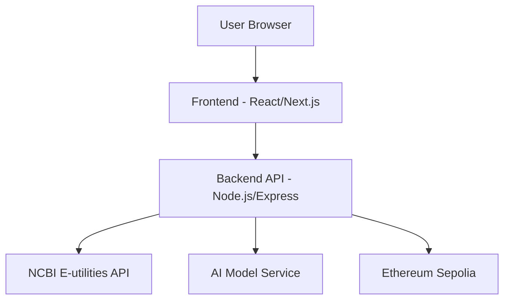
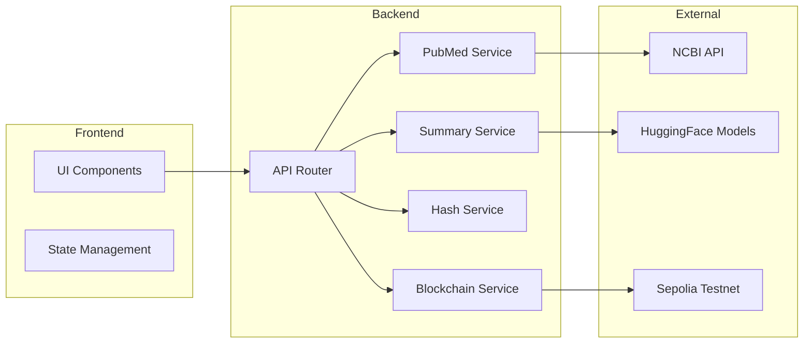

# Design Document: ClinicalProof

## Overview

ClinicalProof is a web application that provides cryptographically verifiable AI-generated medical summaries. The system architecture consists of three main layers:

1. **Frontend Layer**: A responsive web interface for user interaction
2. **Backend Layer**: API services for PubMed retrieval, AI summarization, and blockchain interaction
3. **Blockchain Layer**: Ethereum Sepolia smart contract for immutable hash storage

The application workflow:
- User submits PubMed URL → System extracts PMID → Fetches abstract from NCBI
- System generates three audience-specific summaries using NLP models
- System computes SHA-256 hash of (PMID + summary + timestamp)
- System stores hash on Ethereum Sepolia blockchain
- System returns transaction hash and Etherscan link
- User can later verify any summary by recomputing hash and checking blockchain

## Architecture

### High-Level Architecture



### Component Diagram



## Components and Interfaces

### 1. Frontend Components

**Technology Stack**: React with Next.js for server-side rendering and routing

**Main Components**:

- **InputForm**: Accepts PubMed URL or PMID
  - Input validation for URL format
  - PMID extraction display
  - Submit button with loading state

- **AbstractDisplay**: Shows retrieved PubMed abstract
  - Raw abstract text
  - PMID display
  - Metadata (title, authors, journal)

- **SummaryDisplay**: Renders three summary types
  - Technical summary card
  - Simplified summary card
  - Bullet points summary card
  - Disclaimers: "AI-generated summary", "Not medical advice"

- **VerificationDisplay**: Shows blockchain proof
  - Hash value (truncated with copy button)
  - Transaction hash with Etherscan link
  - Timestamp
  - Verification status indicator

- **VerificationForm**: Allows users to verify existing summaries
  - PMID input
  - Summary text input
  - Verify button
  - Result display (timestamp or "not found")

**API Interface**:
```typescript
interface FrontendAPI {
  fetchAbstract(pmid: string): Promise<AbstractResponse>
  generateSummaries(pmid: string, abstract: string): Promise<SummaryResponse>
  storeProof(hash: string, timestamp: number): Promise<BlockchainResponse>
  verifySummary(pmid: string, summary: string): Promise<VerificationResponse>
}
```

### 2. Backend API Services

**Technology Stack**: Node.js with Express, ethers.js for blockchain interaction

**PubMedService**:
```typescript
class PubMedService {
  extractPMID(url: string): string
  validatePMID(pmid: string): boolean
  fetchAbstract(pmid: string): Promise<Abstract>
}

interface Abstract {
  pmid: string
  title: string
  abstract: string
  authors: string[]
  journal: string
  pubDate: string
}
```

**SummaryService**:
```typescript
class SummaryService {
  generateTechnicalSummary(abstract: string): Promise<string>
  generateSimplifiedSummary(abstract: string): Promise<string>
  generateBulletSummary(abstract: string): Promise<string[]>
  generateAllSummaries(abstract: string): Promise<SummarySet>
}

interface SummarySet {
  technical: string
  simplified: string
  bullets: string[]
  timestamp: number
}
```

**HashService**:
```typescript
class HashService {
  computeHash(pmid: string, summary: string, timestamp: number): string
  verifyHash(pmid: string, summary: string, timestamp: number, hash: string): boolean
}
```

**BlockchainService**:
```typescript
class BlockchainService {
  storeHash(hash: string, timestamp: number): Promise<TransactionReceipt>
  verifyHash(hash: string): Promise<VerificationResult>
  getTransactionLink(txHash: string): string
}

interface TransactionReceipt {
  transactionHash: string
  blockNumber: number
  gasUsed: string
}

interface VerificationResult {
  exists: boolean
  timestamp?: number
}
```

### 3. Smart Contract

**Technology**: Solidity for Ethereum

**Contract Interface**:
```solidity
contract ClinicalProof {
    struct ProofRecord {
        bytes32 hash;
        uint256 timestamp;
        bool exists;
    }
    
    mapping(bytes32 => ProofRecord) public proofs;
    
    function storeProof(bytes32 _hash, uint256 _timestamp) external returns (bool)
    function verifyProof(bytes32 _hash) external view returns (bool exists, uint256 timestamp)
    function getProofTimestamp(bytes32 _hash) external view returns (uint256)
}
```

**Key Features**:
- Immutable after deployment
- Public read access for verification
- Stores hash → timestamp mapping
- Emits events for indexing

### 4. External Service Integrations

**NCBI E-utilities API**:
- Endpoint: `https://eutils.ncbi.nlm.nih.gov/entrez/eutils/efetch.fcgi`
- Parameters: `db=pubmed&id={PMID}&retmode=xml`
- Rate limit: 3 requests per second (enforced by backend)
- Response: XML format, parsed to extract abstract and metadata

**HuggingFace Models**:
- Primary: `facebook/bart-large-cnn` for general summarization
- Secondary: `microsoft/BiomedNLP-PubMedBERT` for medical domain
- Inference: Via HuggingFace Inference API or local deployment
- Fallback: If one model fails, use the other

**Ethereum Sepolia**:
- RPC Provider: Infura or Alchemy
- Network ID: 11155111
- Gas estimation: Dynamic based on network conditions
- Transaction confirmation: Wait for 1 block confirmation

## Data Models

### Abstract Model
```typescript
interface Abstract {
  pmid: string              // PubMed identifier
  title: string             // Article title
  abstract: string          // Full abstract text
  authors: string[]         // List of author names
  journal: string           // Journal name
  pubDate: string           // Publication date (ISO 8601)
  doi?: string              // Digital Object Identifier (optional)
}
```

### Summary Model
```typescript
interface Summary {
  pmid: string              // Source PMID
  technical: string         // Technical summary for professionals
  simplified: string        // Simplified summary for general audience
  bullets: string[]         // Key facts as bullet points
  timestamp: number         // Unix timestamp of generation
  hash: string              // SHA-256 hash of summary data
}
```

### Proof Model
```typescript
interface Proof {
  hash: string              // SHA-256 hash value
  timestamp: number         // Unix timestamp
  transactionHash: string   // Ethereum transaction hash
  blockNumber: number       // Block number on Sepolia
  etherscanLink: string     // Full Etherscan URL
}
```

### Verification Request Model
```typescript
interface VerificationRequest {
  pmid: string              // PMID to verify
  summary: string           // Summary text to verify
}

interface VerificationResponse {
  valid: boolean            // Whether hash exists on blockchain
  timestamp?: number        // Original timestamp if valid
  hash: string              // Computed hash value
  message: string           // Human-readable result
}
```

## Correctness Properties

*A property is a characteristic or behavior that should hold true across all valid executions of a system—essentially, a formal statement about what the system should do. Properties serve as the bridge between human-readable specifications and machine-verifiable correctness guarantees.*


### Property 1: PMID Extraction Correctness

*For any* valid PubMed URL (containing a numeric PMID), extracting the PMID and then constructing a PubMed URL with that PMID should produce a URL that resolves to the same article.

**Validates: Requirements 1.1**

### Property 2: Hash Computation Determinism

*For any* PMID, summary text, and timestamp, computing the SHA-256 hash twice with the same inputs should produce identical hash values.

**Validates: Requirements 3.1, 3.2**

### Property 3: Bullet Summary Format

*For any* abstract text, the generated bullet summary should be an array of non-empty strings.

**Validates: Requirements 2.3**

### Property 4: Disclaimer Presence

*For any* summary display output (technical, simplified, or bullets), the rendered content should contain both "AI-generated summary" and "Not medical advice" text.

**Validates: Requirements 2.5, 7.1, 7.2**

### Property 5: Limitation Statements Presence

*For any* page displaying summaries or verification results, the rendered content should contain limitation statements including "summaries may omit nuance", "Abstract-only, no full-text parsing", and "Blockchain does not validate medical correctness".

**Validates: Requirements 7.3, 9.4, 9.5**

### Property 6: Etherscan Link Format

*For any* valid Ethereum transaction hash on Sepolia, the generated Etherscan link should follow the format `https://sepolia.etherscan.io/tx/{transactionHash}` and contain the complete transaction hash.

**Validates: Requirements 4.3**

### Property 7: Hash Verification Round-Trip

*For any* PMID, summary text, and timestamp, if a hash is computed and stored, then verifying with the same PMID and summary should successfully retrieve the original timestamp.

**Validates: Requirements 5.1, 5.2, 5.3**

### Property 8: Invalid Hash Verification

*For any* hash that has not been stored in the smart contract, verification should indicate that the summary cannot be verified.

**Validates: Requirements 5.4**

### Property 9: PMID Validation

*For any* input string, PMID validation should accept the string if and only if it contains only numeric characters (0-9).

**Validates: Requirements 6.1**

### Property 10: PubMed URL Validation

*For any* input string, URL validation should accept the string if and only if it matches valid PubMed URL patterns (e.g., contains "pubmed.ncbi.nlm.nih.gov" or "ncbi.nlm.nih.gov/pubmed/" and includes a numeric PMID).

**Validates: Requirements 6.2**

### Property 11: Injection Pattern Rejection

*For any* input string containing SQL injection patterns (e.g., "'; DROP TABLE", "1' OR '1'='1") or script tags (e.g., "<script>", "</script>"), the validation should reject the input.

**Validates: Requirements 6.5**

### Property 12: Rate Limiting Enforcement

*For any* sequence of API requests exceeding the configured rate limit within the time window, the system should reject requests beyond the limit with an appropriate error response.

**Validates: Requirements 6.3**

### Property 13: Smart Contract Storage Round-Trip

*For any* hash value and timestamp, storing them in the smart contract and then querying the contract with the same hash should return the original timestamp.

**Validates: Requirements 10.1, 10.2**

### Property 14: Smart Contract Non-Existent Hash

*For any* hash value that has never been stored in the smart contract, querying the contract should indicate that the hash does not exist.

**Validates: Requirements 10.3**

### Property 15: Verification Success for Valid Hashes

*For any* hash that has been successfully stored on the blockchain, verification should always succeed and return the correct timestamp (100% success rate).

**Validates: Requirements 8.5**

### Property 16: Error Handling for Invalid PMID

*For any* invalid or non-existent PMID, the system should return an error message indicating that the PMID could not be retrieved, rather than crashing or returning incorrect data.

**Validates: Requirements 1.4**

### Property 17: Blockchain Transaction Error Handling

*For any* blockchain transaction that fails (due to network issues, insufficient gas, or contract errors), the system should return an error message indicating that storage failed, rather than claiming success.

**Validates: Requirements 4.4**

### Property 18: Abstract Display Completeness

*For any* successfully fetched abstract, the display output should include the abstract text, PMID, title, and metadata.

**Validates: Requirements 1.3**

## Error Handling

### Error Categories

**1. Input Validation Errors**
- Invalid PMID format (non-numeric)
- Invalid PubMed URL format
- Malicious input (SQL injection, XSS attempts)
- Empty or missing required fields

**Response**: HTTP 400 Bad Request with descriptive error message

**2. External API Errors**
- NCBI API unavailable or timeout
- PMID not found in PubMed
- Rate limit exceeded on NCBI API
- Malformed XML response

**Response**: HTTP 502 Bad Gateway or 404 Not Found with user-friendly message

**3. AI Model Errors**
- Model inference timeout
- Model service unavailable
- Invalid model output format
- Model returns empty summary

**Response**: HTTP 503 Service Unavailable with fallback message, retry with alternative model

**4. Blockchain Errors**
- Insufficient gas for transaction
- Network connectivity issues
- Smart contract call failure
- Transaction timeout

**Response**: HTTP 503 Service Unavailable with error details and suggestion to retry

**5. Rate Limiting Errors**
- Too many requests from single IP
- API quota exceeded

**Response**: HTTP 429 Too Many Requests with retry-after header

### Error Handling Strategy

**Graceful Degradation**:
- If primary AI model fails, attempt with fallback model
- If blockchain storage fails, still return summaries with warning
- Cache successful PubMed fetches to reduce API calls

**User Communication**:
- All errors include human-readable messages
- Technical details logged server-side only
- Suggest corrective actions when possible

**Retry Logic**:
- Exponential backoff for transient failures
- Maximum 3 retry attempts for external APIs
- Circuit breaker pattern for blockchain calls

**Logging**:
- Log all errors with context (PMID, timestamp, user IP)
- Track error rates for monitoring
- Alert on critical failures (blockchain unavailable, model failures)

## Testing Strategy

### Dual Testing Approach

The testing strategy employs both unit tests and property-based tests as complementary approaches:

**Unit Tests**: Focus on specific examples, edge cases, and integration points
- Specific PMID extraction examples (various URL formats)
- Edge cases: empty abstracts, special characters, very long texts
- Error conditions: network failures, invalid responses
- Integration: API mocking, contract interaction

**Property-Based Tests**: Verify universal properties across randomized inputs
- Generate random PMIDs, URLs, summaries, hashes
- Test properties hold for all generated inputs
- Minimum 100 iterations per property test
- Catch edge cases that manual examples might miss

Together, these approaches provide comprehensive coverage: unit tests catch concrete bugs in specific scenarios, while property tests verify general correctness across the input space.

### Property-Based Testing Configuration

**Framework**: 
- JavaScript/TypeScript: `fast-check` library
- Solidity: `foundry` with fuzzing support

**Configuration**:
- Minimum 100 iterations per property test
- Seed-based randomization for reproducibility
- Shrinking enabled to find minimal failing cases

**Test Tagging**:
Each property-based test must include a comment referencing the design property:
```typescript
// Feature: clinical-proof, Property 2: Hash Computation Determinism
test('hash computation is deterministic', () => {
  fc.assert(fc.property(
    fc.string(), fc.string(), fc.integer(),
    (pmid, summary, timestamp) => {
      const hash1 = computeHash(pmid, summary, timestamp);
      const hash2 = computeHash(pmid, summary, timestamp);
      return hash1 === hash2;
    }
  ), { numRuns: 100 });
});
```

### Test Coverage Requirements

**Backend Services** (Target: 90% coverage):
- PubMedService: URL parsing, PMID validation, API integration
- SummaryService: Model invocation, response handling, error cases
- HashService: SHA-256 computation, input handling
- BlockchainService: Contract interaction, transaction handling

**Smart Contract** (Target: 100% coverage):
- All public functions
- All state transitions
- All error conditions
- Gas optimization verification

**Frontend Components** (Target: 80% coverage):
- User input validation
- API response handling
- Error display
- Disclaimer rendering

### Integration Testing

**End-to-End Flows**:
1. Submit PMID → Fetch abstract → Generate summaries → Store proof → Verify
2. Submit invalid PMID → Receive error → Display error message
3. Verify non-existent summary → Receive "not found" → Display result

**External Service Mocking**:
- Mock NCBI API responses (success, failure, timeout)
- Mock HuggingFace model inference
- Mock Ethereum RPC provider
- Use local testnet for contract testing

### Performance Testing

**Load Testing**:
- Simulate concurrent users (10, 50, 100)
- Measure response times under load
- Verify rate limiting works correctly
- Test graceful degradation

**Benchmarks**:
- PubMed fetch: < 2 seconds
- Summary generation: < 5 seconds total
- Hash computation: < 10ms
- Blockchain storage: < 30 seconds (depends on network)
- Verification: < 3 seconds

### Security Testing

**Input Validation**:
- Fuzz testing with malformed inputs
- SQL injection attempt detection
- XSS payload rejection
- Buffer overflow prevention

**Smart Contract Security**:
- Reentrancy attack prevention
- Integer overflow/underflow checks
- Access control verification
- Gas limit testing

### Continuous Integration

**Automated Test Execution**:
- Run all unit tests on every commit
- Run property tests on every pull request
- Run integration tests before deployment
- Run security scans weekly

**Test Reporting**:
- Coverage reports in CI pipeline
- Failed test notifications
- Performance regression detection
- Security vulnerability alerts

## Deployment Architecture

### Infrastructure

**Frontend Hosting**: Vercel or Netlify
- Static site generation with Next.js
- CDN distribution
- Automatic HTTPS
- Environment variable management

**Backend Hosting**: Railway, Render, or AWS Lambda
- Node.js runtime
- Environment variables for API keys
- Auto-scaling based on load
- Health check endpoints

**Blockchain**: Ethereum Sepolia Testnet
- RPC provider: Infura or Alchemy free tier
- Smart contract deployed once
- Contract address stored in environment variables

### Environment Variables

```
# NCBI API
NCBI_API_KEY=<optional-api-key>
NCBI_EMAIL=<required-email>

# AI Models
HUGGINGFACE_API_KEY=<api-key>
MODEL_PRIMARY=facebook/bart-large-cnn
MODEL_SECONDARY=microsoft/BiomedNLP-PubMedBERT

# Blockchain
ETHEREUM_RPC_URL=<infura-or-alchemy-url>
CONTRACT_ADDRESS=<deployed-contract-address>
PRIVATE_KEY=<deployer-private-key>
SEPOLIA_CHAIN_ID=11155111

# Rate Limiting
RATE_LIMIT_WINDOW_MS=60000
RATE_LIMIT_MAX_REQUESTS=10

# Application
NODE_ENV=production
PORT=3000
```

### Monitoring and Observability

**Metrics to Track**:
- Request count and response times
- Error rates by category
- PubMed API success rate
- AI model inference times
- Blockchain transaction success rate
- Rate limit hits

**Logging**:
- Structured JSON logs
- Log levels: ERROR, WARN, INFO, DEBUG
- Include request IDs for tracing
- Sanitize sensitive data

**Alerts**:
- Error rate > 5%
- Response time > 10 seconds
- Blockchain transaction failures
- External API unavailability

## Security Considerations

**Input Sanitization**:
- Validate all user inputs before processing
- Escape HTML in displayed content
- Reject suspicious patterns
- Limit input length

**API Security**:
- Rate limiting per IP address
- CORS configuration for frontend domain
- API key rotation policy
- Request size limits

**Smart Contract Security**:
- Immutable after deployment (no upgrade mechanism)
- No owner privileges (fully decentralized)
- Public read access only
- Gas-efficient operations

**Data Privacy**:
- No user authentication required
- No personal data collected
- No cookies except essential ones
- GDPR compliant (public data only)

## Limitations and Future Enhancements

### Current Limitations

1. **Abstract-only processing**: Full-text articles not supported
2. **Testnet only**: Sepolia has no real value, mainnet deployment requires funding
3. **AI quality**: Summaries may omit nuance or context
4. **No medical validation**: Blockchain proves authenticity, not correctness
5. **Single source**: Only PubMed, no other medical databases

### Future Enhancements

**Phase 2**:
- Multi-model consensus (compare outputs from multiple AI models)
- Version tracking (store multiple summary versions)
- Citation extraction and linking
- PDF export with QR code for verification

**Phase 3**:
- Zero-knowledge proofs for privacy-preserving verification
- Institutional verification nodes (hospitals, universities)
- Integration with other medical databases (Cochrane, ClinicalTrials.gov)
- Mainnet deployment with gas optimization

**Phase 4**:
- Decentralized storage (IPFS) for full summaries
- DAO governance for model selection
- Reputation system for summary quality
- Mobile app with offline verification
